# 04 — Entity Relationship Diagram (ERD) (FINAL)

**Status:** **FINAL — single source of truth (v2.0).** Canonical data model after the migration analysis (docs 16/17) and the approved decisions. Uses Table-Per-Hierarchy for collection content (`ContentItem` + discriminator), translation tables for all multilingual text, and dedicated small entities for the profile-page/list data surfaced by the static site. Identity tables are managed by ASP.NET Core Identity and omitted for clarity.

## 1. ERD (Mermaid)

```mermaid
erDiagram
    SiteSettings ||--o{ SiteSettingsTranslation : "has translations"
    SiteSettings }o--o| MediaFile : "logo"

    Profile ||--o{ ProfileTranslation : "has translations"
    Profile }o--o| MediaFile : "photo"
    ProfileTranslation }o--o| MediaFile : "cv (per culture)"

    ContentItem ||--o{ ContentItemTranslation : "has translations"
    ContentItem }o--o| MediaFile : "cover image"
    ContentItem }o--o| MediaFile : "pdf file"
    ContentItem ||--o{ ContentItemCategory : "tagged with"
    Category ||--o{ ContentItemCategory : "groups"
    Category ||--o{ CategoryTranslation : "has translations"
    ContentItem ||--o{ ContentEvent : "generates"

    Qualification ||--o{ QualificationTranslation : "has translations"
    Skill ||--o{ SkillTranslation : "has translations"
    Membership ||--o{ MembershipTranslation : "has translations"
    StatItem ||--o{ StatItemTranslation : "has translations"
    Credibility ||--o{ CredibilityTranslation : "has translations"
    Credibility }o--o| MediaFile : "logo"
    ActivityGroup ||--o{ ActivityGroupTranslation : "has translations"
    ActivityGroup ||--o{ Activity : "contains"
    Activity ||--o{ ActivityTranslation : "has translations"

    PageSection ||--o{ PageSectionTranslation : "has translations"
    ExperienceEntry ||--o{ ExperienceEntryTranslation : "has translations"
    Course ||--o{ CourseTranslation : "has translations"

    SiteSettings {
        int Id PK
        string DefaultCulture
        string DefaultTheme
        int LogoMediaId FK
        string FacebookUrl
        string WhatsAppNumber
        string ContactEmail
        string PrimaryColor
        string SecondaryColor
        datetime ModifiedUtc
    }
    SiteSettingsTranslation {
        int Id PK
        int SiteSettingsId FK
        string Culture
        string SiteTitle
        string FooterText
        string Tagline
    }
    Profile {
        int Id PK
        int PhotoMediaId FK
        date DateOfBirth
        string Email
        string Phone
        datetime ModifiedUtc
    }
    ProfileTranslation {
        int Id PK
        int ProfileId FK
        string Culture
        string FullName
        string ShortName
        string Title
        string Positioning
        string ShortBio
        string FullBio
        string Nationality
        string MaritalStatus
        string Location
        string Languages
        int CvFileId FK
    }
    ContentItem {
        int Id PK
        string ContentType "discriminator"
        int CoverImageId FK
        int PdfFileId FK
        string ExternalUrl
        string YouTubeVideoId
        int PublicationYear
        datetime EventDateUtc
        string Doi
        string DegreeLevel "Thesis"
        string RelationshipType "Thesis: Supervised|Examined|Ongoing"
        string ProjectStatus "Project"
        string Role "Project"
        string ResourceType "Resource|Enrichment"
        bool IsPublished
        bool IsFeatured
        int SortOrder
        int ViewCount
        int DownloadCount
        datetime ModifiedUtc
    }
    ContentItemTranslation {
        int Id PK
        int ContentItemId FK
        string Culture
        string Title
        string Slug
        string Summary
        string Body
        string Journal "Pub|Research"
        string Authors "Pub|Research"
        string Publisher "Book"
        string AuthorshipRole "Book"
        string ResearcherName "Thesis"
        string MetaTitle
        string MetaDescription
        string MetaKeywords
    }
    Category {
        int Id PK
        int SortOrder
        datetime ModifiedUtc
    }
    CategoryTranslation {
        int Id PK
        int CategoryId FK
        string Culture
        string Name
        string Slug
    }
    ContentItemCategory {
        int ContentItemId PK_FK
        int CategoryId PK_FK
    }
    Qualification {
        int Id PK
        int Year
        int SortOrder
    }
    QualificationTranslation {
        int Id PK
        int QualificationId FK
        string Culture
        string Degree
        string Institution
        string Grade
    }
    Skill {
        int Id PK
        int SortOrder
    }
    SkillTranslation {
        int Id PK
        int SkillId FK
        string Culture
        string Name
    }
    Membership {
        int Id PK
        string Kind "Society|Board"
        int SortOrder
    }
    MembershipTranslation {
        int Id PK
        int MembershipId FK
        string Culture
        string Name
    }
    StatItem {
        int Id PK
        int Value
        string Suffix
        int SortOrder
    }
    StatItemTranslation {
        int Id PK
        int StatItemId FK
        string Culture
        string Label
    }
    Credibility {
        int Id PK
        int LogoMediaId FK
        int SortOrder
    }
    CredibilityTranslation {
        int Id PK
        int CredibilityId FK
        string Culture
        string Name
    }
    ActivityGroup {
        int Id PK
        int SortOrder
    }
    ActivityGroupTranslation {
        int Id PK
        int ActivityGroupId FK
        string Culture
        string Name
    }
    Activity {
        int Id PK
        int ActivityGroupId FK
        int SortOrder
    }
    ActivityTranslation {
        int Id PK
        int ActivityId FK
        string Culture
        string Text
    }
    PageSection {
        int Id PK
        string PageKey
        int SortOrder
    }
    PageSectionTranslation {
        int Id PK
        int PageSectionId FK
        string Culture
        string Heading
        string Body
    }
    ExperienceEntry {
        int Id PK
        datetime StartDateUtc
        datetime EndDateUtc
        int SortOrder
    }
    ExperienceEntryTranslation {
        int Id PK
        int ExperienceEntryId FK
        string Culture
        string Role
        string Organization
        string Description
        string PeriodLabel
    }
    Course {
        int Id PK
        string Level "Undergraduate|Graduate"
        string Period
        int SortOrder
    }
    CourseTranslation {
        int Id PK
        int CourseId FK
        string Culture
        string CourseName
        string Institution
        string Description
    }
    MediaFile {
        int Id PK
        string StoredFileName
        string OriginalFileName
        string RelativePath
        string ContentType
        string MediaKind
        int SizeBytes
        int Width
        int Height
        string AltText
        datetime CreatedUtc
    }
    ContactMessage {
        int Id PK
        string Name
        string Email
        string Subject
        string Message
        bool IsRead
        string IpAddress
        datetime CreatedUtc
    }
    ContentEvent {
        int Id PK
        int ContentItemId FK
        string EventType
        string Culture
        datetime CreatedUtc
    }
    PageView {
        int Id PK
        string Path
        string Culture
        datetime CreatedUtc
    }
    PageSeo {
        int Id PK
        string PageKey
        string Culture
        string MetaTitle
        string MetaDescription
        string MetaKeywords
    }
    Redirect {
        int Id PK
        string FromPath
        string ToPath
        int StatusCode
        bool IsActive
        string Notes
        datetime ModifiedUtc
    }
```

## 2. Cardinality Notes

| Relationship | Cardinality | Meaning |
|---|---|---|
| ContentItem → ContentItemTranslation | 1 : 0..N | one item, up to one row per culture (ar/en/fr) |
| ContentItem ↔ Category | M : N | via `ContentItemCategory` |
| ContentItem → MediaFile (cover / pdf) | N : 0..1 each | optional |
| ContentItem → ContentEvent | 1 : 0..N | view/download/play events |
| Profile → ProfileTranslation | 1 : 0..N | translated; each translation may carry its own CV file |
| ProfileTranslation → MediaFile (cv) | N : 0..1 | per-culture CV PDF |
| Qualification/Skill/Membership/StatItem/Credibility → *Translation | 1 : 0..N | trilingual list data |
| ActivityGroup → Activity | 1 : 0..N | grouped activities |
| Activity / ActivityGroup → *Translation | 1 : 0..N | trilingual |
| Credibility → MediaFile (logo) | N : 0..1 | optional institution logo |
| PageSection / ExperienceEntry / Course → *Translation | 1 : 0..N | trilingual |
| Redirect | standalone | request-path 301/302 resolution |

## 3. Reading the Model

- A content list page (e.g. "Publications" in French) is: `ContentItem WHERE ContentType='Publication' AND IsPublished=1` joined to `ContentItemTranslation WHERE Culture='fr'`, ordered by `SortOrder`. If the `fr` row is missing, the render falls back to the default-culture translation (doc 10 §5).
- The **theses table** is `ContentItem WHERE ContentType='Thesis'` + translation, with public facets on `RelationshipType` (Supervised/Examined/Ongoing), `DegreeLevel` (Master/PhD), and `PublicationYear`, plus `ResearcherName`/`Title` search.
- The **homepage** assembles: hero (`PageSection` + `Profile`), `Credibility` chips, `StatItem` counters, about snapshot (`Profile`/`PageSection`), `ContentItem WHERE ContentType='Book' AND IsFeatured=1`, and a CTA band.
- The **About page** assembles `Profile` (+ translation incl. personal details + CV), `Qualification`, `Skill`, and biography.
- The **Experience page** assembles `ExperienceEntry` (timeline) + `Membership` (Society/Board groups).
- The **Activities page** assembles `ActivityGroup` → `Activity`.
- Adding a new content type later = a new discriminator value + (optionally) a subclass; **no schema migration of existing tables** beyond possibly a nullable column.
